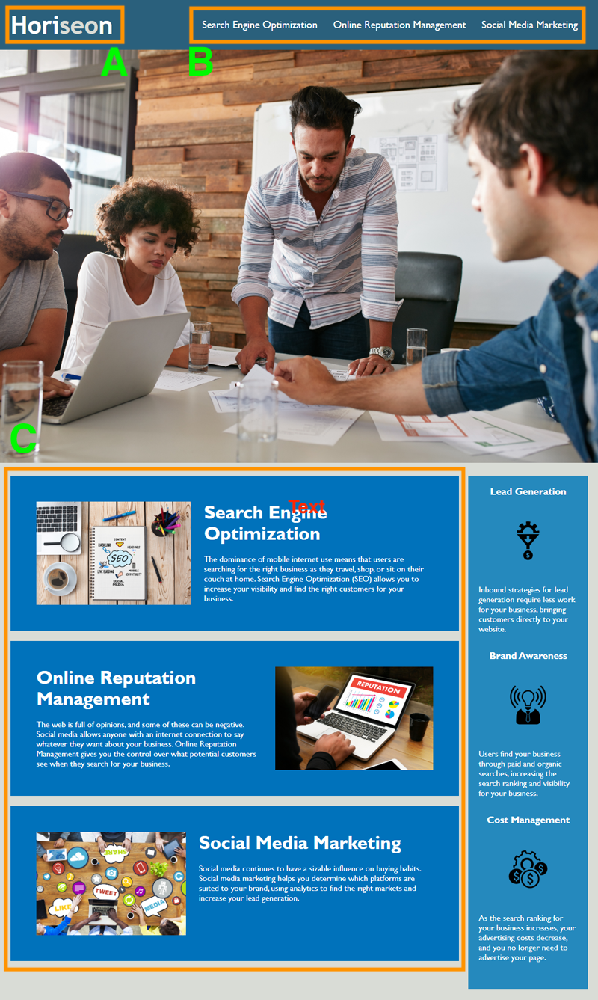

# Horiseon Code Refactor

## Description 

The goal of this work is to take Horiseon's existing code and refactor it to meet the current web accessibility standards to make it available to a wider variety of audiences 

The old source code of Horiseon's website was a div soup; multiple divs without proper web semantics. This made it difficult for a web crawler to read their contents, and it also made it hard for viewers using screen readers. 

I've implemented web semantic elements such as <segment> to clearly group each components or the website. This resolves the "dip soup" and makes the web site more "crawlable." Second goal was to comment on each styles on the CSS file; selectors and properties were consolidated as well to follow the semantic structure. This makes the code base more sustainable in the future; allowing easy tracking of changes applied to it.

My motivation was to simply make this site available to a wider set of audience. Making a website accessible would bring a lot of ROI for a marketing company. 

## Deployment
Here are the links to my work: 
https://bctan87.github.io/Code-refactor/
https://github.com/bctan87/Code-refactor

## Usage 
Please refer to the screecap: 
```md

```
A. Branding - clicking on this would bring the user back to the homepage/top of the directory.

B. Navigation - clicking on one of these would take the user to their corresponding articles located in section C.

C. Articles - connected to the top navigation.

## Credits
https://www.w3schools.com/

https://developer.mozilla.org/en-US/


